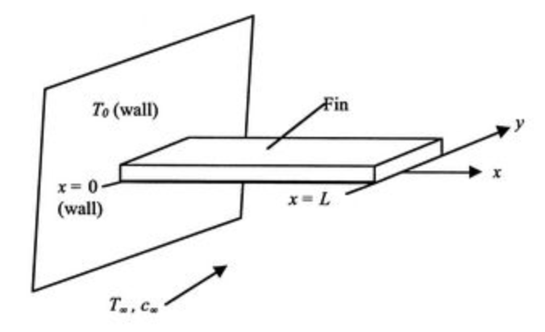
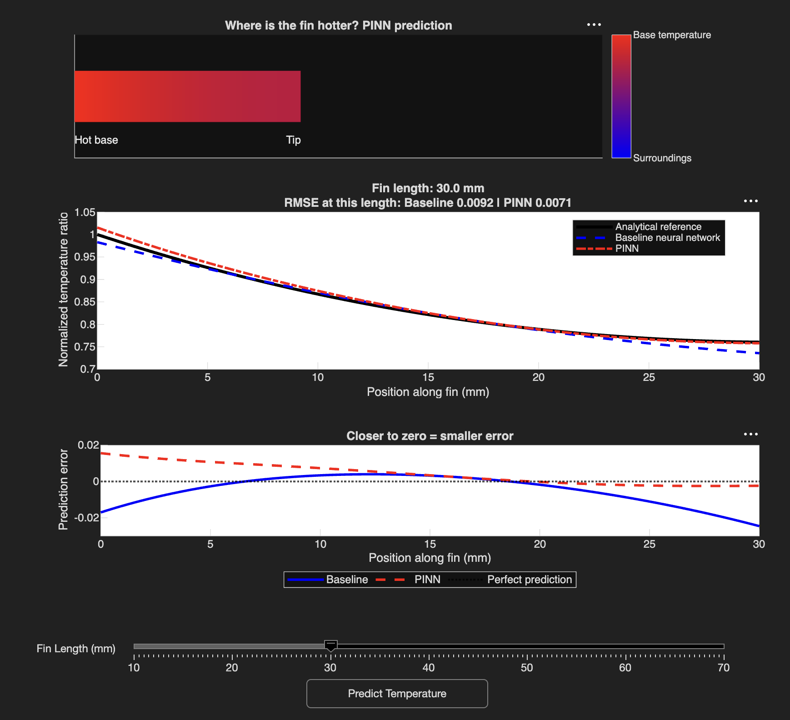

# Fin Temperature Prediction Using MATLAB and Neural Networks

How does temperature change along a metal fin?
Can we teach a computer to predict it?

This project uses MATLAB to calculate temperatures, train a
neural network, and explore whether adding physical rules
improves its predictions.

An interactive MATLAB app lets you change the fin length,
see the predicted temperature, and compare the models.

## What Is a Fin?

A fin is a metal piece that helps remove heat from a hot object.
You can find fins in cooling systems, such as computer heat sinks.

The end attached to the hot object is called the base.
The opposite end is called the tip.

Temperature usually decreases as we move from the base
toward the tip.

Our goal is to predict temperature at different positions
along fins of different lengths.

*Heat flows from the hot wall into the fin and escapes into
the surrounding air. Our MATLAB models predict temperature
from the base (x = 0) to the tip (x = L).*

Source: [Original image source](FIN_SOURCE_URL)

## Step 1: Calculate Temperatures Using MATLAB

We first used a heat-transfer equation in MATLAB to calculate
temperature profiles for 50 fin lengths, ranging from 10 to 70 mm.

For each length, we calculated temperatures at 100 positions.
This gave us a dataset containing 5,000 examples.

Each example contains:

- Position along the fin.
- Fin length.
- Normalized temperature ratio.

The temperature ratio describes how much warmer a position
is than the surroundings, relative to the fin’s base.

A value of 1 represents the base temperature.
A value of 0 represents the surrounding temperature.

These calculated values became our answer sheet for
training and checking the models.

## Step 2: Train a Neural Network

Next, we trained a neural network in MATLAB.

A neural network learns patterns from examples.
We gave it the position and fin length and taught it to
predict the temperature ratio.

During training, the network compared its predictions
with the calculated answers and adjusted its internal
weights to reduce its mistakes.

This model learns from temperature data alone.
We call it our baseline because it is the starting model
used for comparison.

## Step 3: Check Predictions on Unseen Fin Lengths

We tested the baseline on fin lengths that it had not
seen during training.

We compared its predictions with the answers from the
heat-transfer equation.

The closer the prediction curves are to the equation’s
curves, the better the model performs.

## Step 4: Add Physical Rules Using a PINN

We then built a physics-informed neural network, or PINN.

The baseline learns from examples.
The PINN learns from examples and receives extra guidance
from the rules of heat transfer.

During training, it receives a penalty when its predictions
disagree with:

- The equation describing heat transfer along the fin.
- The known temperature at the base.
- The heat-loss condition at the tip.

The network adjusts its weights to reduce both its
prediction mistakes and its disagreement with these rules.

The penalties encourage the model to follow the physics,
but they do not guarantee that every prediction is correct
or that the rules are satisfied exactly.

## Step 5: Compare the Baseline and PINN

We evaluated both models on the same unseen fin lengths.

| Error measure | Baseline neural network | PINN |
|---|---:|---:|
| MAE: average absolute error | 0.009140 | 0.008527 |
| RMSE: gives more weight to larger mistakes | 0.011525 | 0.010419 |

Smaller values mean better predictions.

In this experiment, the PINN achieved:

- 6.7% lower MAE.
- 9.6% lower RMSE.

The PINN performed slightly better overall in this run.
It was not necessarily better at every position or fin length.

These errors measure the normalized temperature ratio,
not temperature in degrees Celsius or Kelvin.

### Training Progress

The following plot shows how the PINN’s training errors
changed as it learned.

Lower values indicate less disagreement with the
temperature data or physical rules.

## Step 6: Explore the Results in an Interactive MATLAB App

We built a demo using MATLAB App Designer so that someone
can explore the results without editing the training scripts.

Move the slider to choose a fin length between 10 and 70 mm,
then click **Predict Temperature**.

The app uses the saved neural networks to make predictions.
It does not retrain them each time you click the button.

### What Does the Demo Show?

**The coloured fin**

The top illustration shows the PINN’s predicted temperature
along the fin.

Red represents temperatures closer to the hot base.
Blue represents temperatures closer to the surroundings.
Intermediate colours show temperatures between these values.

The strip is an illustration of the 1D prediction.
It is not a 2D or 3D simulation.

**The temperature comparison**

The middle plot compares three curves:

- Black: the analytical answer from the heat-transfer equation.
- Blue: the baseline neural network’s prediction.
- Red: the PINN’s prediction.

When the curves are close together, the models are predicting
values close to the analytical answer.

The displayed RMSE values measure each model’s error
for the selected fin length.

**The prediction-error plot**

The bottom plot makes small differences easier to see.

It shows each prediction minus the analytical answer:

- Zero means the prediction matches the analytical answer.
- Above zero means the model predicts too high.
- Below zero means the model predicts too low.

A curve closer to zero has a smaller error at that position.

The demo’s errors apply to the selected fin length.
The results in Step 5 summarize the full held-out test set.

## Connection to Our Research

During our heat-transfer research, we used both MATLAB
and Python/PyTorch to develop and evaluate neural-network
models for temperature prediction.

The work began with an analytical single-fin study.
It then extended to 3D heat-sink temperature prediction
using OpenFOAM CFD data and PyTorch, as described in our
ASME FEDSM 2026 paper.

*A heat sink uses many fins to remove heat. The single-fin
study provides a simple starting point for understanding
the more complex 3D heat-sink problem.*

*This is an external illustration, not output from our models.*

Source: [Original image source](HEAT_SINK_SOURCE_URL)

This repository presents the MATLAB single-fin workflow.

The MATLAB PINN and interactive demo were developed
separately as extensions of this work.
They were not included in the paper.

## Run the Project in MATLAB

MATLAB and Deep Learning Toolbox are required.

### Generate Data and Train the Models

Run these scripts in order:

1. `generate_fin_data.m`  
   Calculates temperature profiles and saves the dataset.

2. `train_fin_surrogate.m`  
   Trains the baseline neural network and saves its results.

3. `train_fin_pinn.m`  
   Trains the PINN and compares it with the baseline.

### Run the Interactive Demo

To use the existing trained models:

1. Download the repository and open its folder in MATLAB.
2. Keep these files in the MATLAB current folder:
   - `fin_temperature_demo.mlapp`
   - `fin_surrogate_model.mat`
   - `fin_pinn_model.mat`
3. Open `fin_temperature_demo.mlapp` in App Designer.
4. Click **Run**.
5. Choose a fin length and click **Predict Temperature**.

No retraining is needed when using the saved models.

## Tools Used

- MATLAB for calculations, data generation, training,
  evaluation, and plots.
- Deep Learning Toolbox for neural networks and
  automatic differentiation.
- MATLAB App Designer for the interactive demo.
- Python/PyTorch in the related research workflow.
