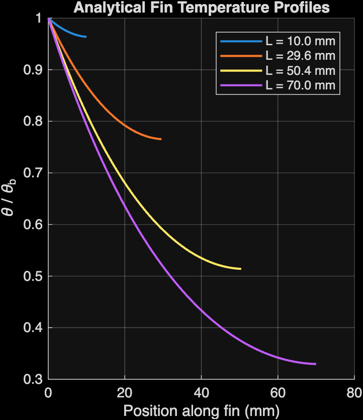
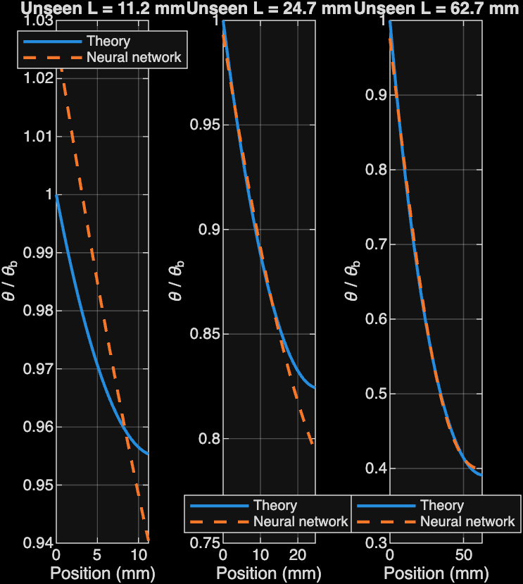
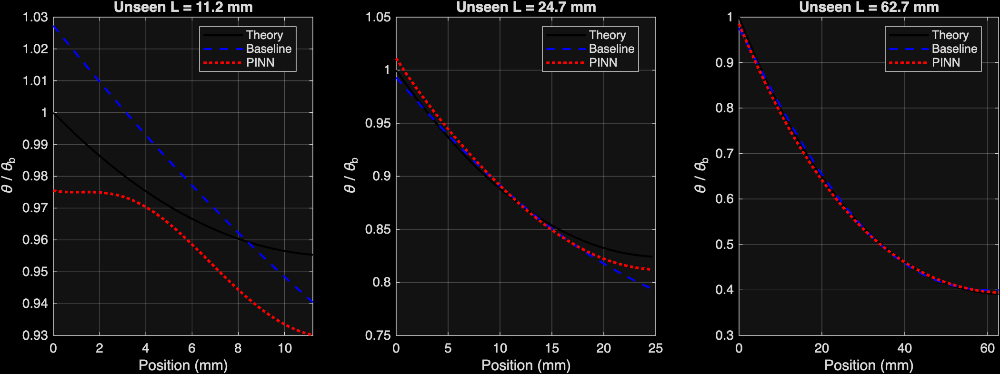
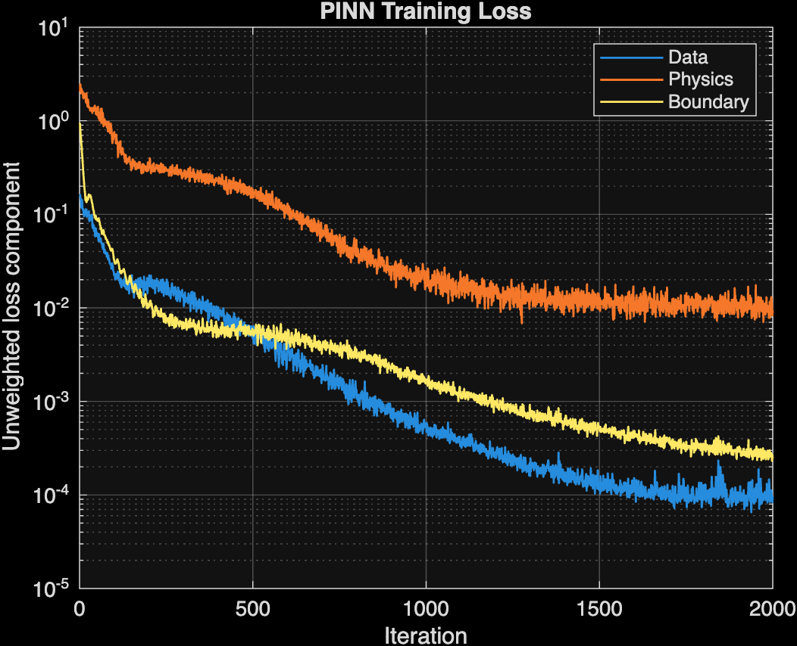

# Fin Temperature Prediction Using MATLAB and Neural Networks

How does temperature change along a metal fin?
Can we teach a computer to predict it?

This project uses MATLAB to calculate temperatures, train a
neural network, and explore whether adding physical rules
improves its predictions.

## What Is a Fin?

A fin is a metal piece that helps remove heat from a hot object.
You can find fins in cooling systems, such as computer heat sinks.

The end attached to the hot object is called the base.
The opposite end is called the tip.

Temperature usually decreases as we move from the base
toward the tip.

Our goal is to predict temperature at different positions
along fins of different lengths.

## Step 1: Calculate Temperatures Using MATLAB

We first used a heat-transfer equation in MATLAB to calculate
temperature profiles for 50 fin lengths.

For each length, we calculated temperatures at 100 positions.
This gave us a dataset containing 5,000 examples.

Each example contains:
- Position along the fin.
- Fin length.
- Normalized temperature ratio.

The temperature ratio describes how much warmer a position
is than the surroundings, relative to the fin’s base.
A value of 1 represents the base temperature.

These calculated values became our answer sheet for
training and checking the models.

## Step 2: Train a Neural Network

Next, we trained a neural network in MATLAB.

A neural network learns patterns from examples.
We gave it the position and fin length and taught it to
predict the temperature ratio.

This model learns from temperature data alone.
We call it our baseline because it is the starting model
used for comparison.

## Step 3: Check Predictions on Unseen Fin Lengths

We tested the baseline on fin lengths that it had not
seen during training.

We compared its predictions with the answers from the
heat-transfer equation.

The closer the prediction curves are to the equation’s
curves, the better the model performs.

## Step 4: Add Physical Rules Using a PINN

We then built a physics-informed neural network, or PINN.

The baseline learns from examples.
The PINN learns from examples and receives extra guidance
from the rules of heat transfer.

During training, it receives a penalty when its predictions
disagree with:
- The equation describing heat transfer along the fin.
- The known temperature at the base.
- The heat-loss condition at the tip.

Think of a student learning from solved examples.
The PINN also learns the rules behind those answers.

The penalties encourage the model to follow these rules,
but they do not guarantee that every prediction is correct.

## Step 5: Compare the Baseline and PINN

We evaluated both models on the same unseen fin lengths.

| Error measure | Baseline neural network | PINN |
|---|---:|---:|
| MAE: average absolute error | 0.009140 | 0.008527 |
| RMSE: gives more weight to larger mistakes | 0.011525 | 0.010419 |

Smaller values mean better predictions.

In this experiment, the PINN achieved:
- 6.7% lower MAE.
- 9.6% lower RMSE.

The PINN performed slightly better overall in this run.
It was not necessarily better at every position or fin length.

These errors measure the normalized temperature ratio,
not temperature in degrees Celsius or Kelvin.

### Training Progress

The following plot shows how the PINN’s training errors
changed as it learned.

Lower values indicate less disagreement with the
temperature data or physical rules.

## Connection to Our Research

During our heat-transfer research, we used both MATLAB
and Python/PyTorch to develop and evaluate neural-network
models for temperature prediction.

The work began with an analytical single-fin study.
It then extended to 3D heat-sink temperature prediction
using OpenFOAM CFD data and PyTorch, as described in our
ASME FEDSM 2026 paper.

This repository presents the MATLAB single-fin workflow.

The MATLAB PINN was developed separately as an extension
of this work. It was not included in the published paper.

## Run the Project in MATLAB

Run these scripts in order:

1. `generate_fin_data.m`
   Calculates temperature profiles and saves the dataset.

2. `train_fin_surrogate.m`
   Trains the baseline neural network and saves its results.

3. `train_fin_pinn.m`
   Trains the PINN and compares it with the baseline.

## Tools Used

- MATLAB for calculations, model training, evaluation, and plots.
- Deep Learning Toolbox for neural networks and automatic differentiation.
- Python/PyTorch in the related research workflow.
